# 剧情构造师 智能升级报告
============================================================

## 📊 升级概况
- 升级时间：2026-04-30 00:36:38
- 升级系统：Skill智能学习系统 v3.0

## 🎯 升级目标
作为顶尖的AI技能优化专家，我将从**智能化引擎重构**和**人性化交互设计**两个维度，对【剧情构造师】Skill进行全面升级，使其从“灵感建议者”进化为“具备编剧思维的工作伙伴”。

---

## 一、总体优化架构

```
┌─────────────────────────────────────────────────────────┐
│                   剧情构造师 v2.0                         │
├─────────────────────────────────────────────────────────┤
│  人性化交互层（UX）                                      │
│  ┌──────────┐ ┌──────────┐ ┌──────────┐ ┌──────────┐    │
│  │ 情节时间线│ │ 伏笔追踪器│ │ 节奏仪表盘│ │ 模板向导 │    │
│  └──────────┘ └──────────┘ └──────────┘ └──────────┘    │
├─────────────────────────────────────────────────────────┤
│  智能化核心引擎（AI）                                    │
│  ┌──────────────────────┐ ┌──────────────────────┐      │
│  │  逻辑连贯性校验器     │ │  伏笔收束器           │      │
│  └──────────────────────┘ └──────────────────────┘      │
│  ┌──────────────────────┐ ┌──────────────────────┐      │
│  │  节奏控制优化器       │ │  冲突动态生成器        │      │
│  └──────────────────────┘ └──────────────────────┘      │
│  ┌──────────────────────────────────────────────┐      │
│  │           高潮多样性增强模块                   │      │
│  └──────────────────────────────────────────────┘      │
├─────────────────────────────────────────────────────────┤
│  数据层（知识库）                                        │
│  ┌────────┐ ┌────────┐ ┌────────┐ ┌────────┐          │
│  │ 情节模板│ │ 经典案例│ │ 冲突模式│ │ 节奏曲线│          │
│  └────────┘ └────────┘ └────────┘ └────────┘          │
└─────────────────────────────────────────────────────────┘
```

---

## 二、智能化升级实现方案

### 1. 情节逻辑连贯性检查

**问题**：AI生成的情节可能出现因果断裂、角色行为不一致、时间线矛盾等。  
**方案**：构建基于**知识图谱**的逻辑验证引擎，集成**因果链检测**与**一致性约束**。

**实现框架（Python伪代码）**：

```python
class LogicCoherenceChecker:
    def __init__(self):
        self.causal_graph = nx.DiGraph()  # 因果有向图
        self.timeline = []                # 事件时间线（事件ID，时间戳）
        self.character_states = {}        # 角色状态快照

    def add_event(self, event):
        """添加事件并检查逻辑"""
        # 1. 因果检测：前置事件是否存在且已完成
        if event.prerequisites:
            for pre_id in event.prerequisites:
                if not self.causal_graph.has_node(pre_id):
                    raise LogicError(f"事件[{event.id}]缺少前置条件[{pre_id}]")
                if self.causal_graph.nodes[pre_id]['status'] != 'completed':
                    self.suggest_fix(event, "前置事件未完成")

        # 2. 时间线一致性：检查时间戳是否单调递增且无矛盾
        if self.timeline and event.timestamp < self.timeline[-1].timestamp:
            raise LogicError(f"时间倒流错误！事件[{event.id}]时间戳在上一事件之前")
        
        # 3. 角色行为一致性：检查角色状态是否支持此行为
        for char, required_state in event.required_character_state.items():
            if char in self.character_states:
                if self.character_states[char] != required_state:
                    self.suggest_character_development(char, event)
        
        # 更新图谱
        self.causal_graph.add_node(event.id, status='completed')
        if event.prerequisites:
            for pre_id in event.prerequisites:
                self.causal_graph.add_edge(pre_id, event.id)
        self.timeline.append(event)
        # 更新角色状态
        self.character_states.update(event.character_state_changes)

    def suggest_fix(self, event, issue):
        """智能修复建议"""
        # 使用GPT模型生成修复方案
        prompt = f"情节逻辑断裂：{issue}。当前事件：{event}，上下文：{self.context}，请提供3种合理修复方案。"
        return llm.generate(prompt)
```

**智能提示示例**：
> ⚠️ **逻辑风险**：主角在第2章获得“古老钥匙”，第4章直接使用“钥匙开门”，但中间没有描述其携带过程。建议添加携带动作或说明钥匙被遗失再找回。

---

### 2. 伏笔埋设和回收的自动检测

**方案**：建立**伏笔二元组（埋设标记，回收标记）**数据库，通过语义相似度匹配未回收伏笔，并提供回收点建议。

**代码实现**：

```python
class ForeshadowingTracker:
    def __init__(self):
        self.planted = []  # (伏笔ID, 描述, 位置, 状态)
        self.recovered = []
        self.similarity_model = SentenceTransformer('all-MiniLM-L6-v2')

    def plant(self, description, chapter):
        f_id = generate_id()
        self.planted.append({
            'id': f_id,
            'desc': description,
            'chapter': chapter,
            'status': 'open',
            'embedding': self.similarity_model.encode(description)
        })
        return f_id

    def auto_recover(self, new_event_text):
        """自动检测事件文本是否回收了某个伏笔"""
        event_emb = self.similarity_model.encode(new_event_text)
        best_match = None
        best_score = 0.0
        for f in self.planted:
            if f['status'] == 'open':
                score = cosine_similarity(event_emb, f['embedding'])
                if score > 0.75 and score > best_score:
                    best_match = f
                    best_score = score
        if best_match:
            self.recovered.append({
                'foreshadow_id': best_match['id'],
                'recover_event': new_event_text,
                'confidence': best_score
            })
            best_match['status'] = 'recovered'
            return best_match
        return None

    def get_open_foreshadows(self):
        """返回所有未回收伏笔，附带过期警告"""
        return [f for f in self.planted if f['status'] == 'open']
```

**人性化输出**：用颜色标记伏笔状态——🔴未回收 🟢已回收 🟡半回收（可能有多重含义）。  
**【伏笔地图】** 自动生成树状图，显示每个伏笔的埋设点→提示→回收点路径。

---

### 3. 节奏控制的智能建议

**核心**：将情节节奏量化为 **“张弛度”曲线**，对比经典节奏模型（如三幕剧、五步模型、悉德·菲尔德范式），提供实时调校。

```python
class RhythmOptimizer:
    MODELS = {
        'hero_journey': [0.2, 0.5, 0.7, 0.3, 0.8, 0.6, 0.9, 1.0],  # 归一化强度
        'three_act':    [0.3, 0.7, 1.0],
        'fichte_curve': [0.1, 0.3, 0.5, 0.7, 0.9, 1.0]
    }

    def analyze_chapter_rhythm(self, chapter_events):
        # 计算每个事件的冲突强度、情感值
        intensity = []
        for event in chapter_events:
            intensity.append(event.conflict_level + event.emotional_value)
        # 平滑后得到节奏曲线
        curve = self._smooth(intensity)
        # 与选定模型对比
        model = self.MODELS[user.selected_rhythm_template]
        deviation = self._calculate_rmse(curve, model)
        advice = ""
        if deviation > 0.3:
            advice += "高潮部分强度不足，建议增加冲突元素或提升情感张力。"
        if len(curve) < len(model) * 0.5:
            advice += "情节推进过慢，考虑添加转折点。"
        return advice, curve

    def suggest_rhythm_adjustment(self, chapter_id, target_position):
        """针对特定位置给出插入钩子/舒缓段的建议"""
        # 例如：在连续高强度后添加 '喘息点'（日常生活场景）
        pass
```

**仪表盘可视化**：显示节奏曲线与参考模型重叠图，绿色带表示理想区间，红色警示偏离区域。

---

### 4. 高潮设计的多样性增强

**问题**：AI容易生成单一模式高潮（如最终决战）。  
**方案**：构建**高潮范式库**（共12类），每次生成时要求AI从不同类中抽取组合，并引入“反高潮”与“情感高潮”。

**高潮类型矩阵**：
| 类型 | 示例 |
|------|------|
| 真相揭露式 | 角色突然明白身世 |
| 道德抉择式 | 牺牲一人还是保全大局 |
| 多重反转式 | 你以为的盟友是敌人，而后又有反转 |
| 情感爆发式 | 长期压抑后的争吵/和解 |
| 静谧顿悟式 | 在平凡场景中突然领悟真理 |
| 时间赛跑式 | 倒计时与危机并行 |

**生成算法**：

```python
class ClimaxGenerator:
    def __init__(self):
        self.used_patterns = set()

    def generate_climax(self, story_context, avoid_patterns=None):
        available = list(set(CLIMAX_TYPES) - self.used_patterns)
        if len(available) < 2:  # 防止用尽，允许循环但增加变形参数
            available = CLIMAX_TYPES
        chosen = random.choice(available)
        self.used_patterns.add(chosen)
        # 结合上下文用模板生成高潮情节
        prompt = f"基于[故事状态：{story_context}]，使用'{chosen}'高潮类型，生成一个意外但合理的高潮。要求包含3个节拍。"
        return llm.generate(prompt, temperature=0.9)
```

---

### 5. 情节冲突的动态生成

**动态冲突引擎**：基于角色目标、价值观和资源限制，实时计算冲突点，并给出发展分支。

```python
class ConflictDynamicGenerator:
    def __init__(self):
        self.conflict_catalog = {
            'man_vs_self': ['内疚', '恐惧', '欲望'],
            'man_vs_man': ['误解', '竞争', '背叛'],
            'man_vs_society': ['偏见', '压迫', '传统'],
            'man_vs_nature': ['生存', '灾难', '未知']
        }

    def generate_conflict(self, protagonist_goal, obstacles, relationship_map):
        # 分析主角目标列表，找出最大阻力
        conflicts = []
        for goal in protagonist_goal:
            blockers = [obs for obs in obstacles if obs.blocks(goal)]
            if blockers:
                c_type = random.choice(blockers).conflict_type
                conflicted = self._create_conflict_scene(goal, blockers, c_type, relationship_map)
                conflicts.append(conflicted)
        # 若冲突不足，引入内部冲突
        if len(conflicts) < 2:
            conflicts.append(self._generate_internal_conflict(protagonist_goal))
        return conflicts

    def _generate_internal_conflict(self, goal):
        # 例如：追求自由 vs 责任束缚
        return {"type": "man_vs_self", "dilemma": "自由与责任", "stakes": "放弃家庭或放弃梦想"}
```

---

## 三、人性化升级实现方案

### 1. 多种情节模板库

**模板结构**：采用“故事蓝图”JSON Schema，包含节奏曲线、经典情节点、角色弧光建议。

**模板分类**（预置20+，可社区扩展）：
- **经典类型**：英雄之旅、三幕剧、五幕逆转、罗密欧与朱丽叶式
- **类型小说**：悬疑爆点式、浪漫喜剧转弯、科幻硬转折
- **实验性**：多线叙事、倒叙拼图、环形结构

**新手选择器**：
```
请选择你故事的基调：
▶ 冒险史诗  ▶ 悬疑推理  ▶ 浪漫爱情  ▶ 黑暗反乌托邦  ▶ 轻松日常

根据选择，自动推荐3个最适合的模板，并展示“模板骨架预览”。
```

### 2. 可视化情节时间线

使用**Mermaid.js**或**HTML Canvas**生成交互式时间线，节点可拖拽调整顺序，点击编辑事件详情。

**生成代码示例**：

```mermaid
gantt
    title 故事时间线
    dateFormat  DD
    axisFormat  %d日
    section 幕
    第一幕 :a1, 01, 15d
    第二幕 :a2, after a1, 30d
    第三幕 :a3, after a2, 20d
    section 关键事件
    平凡世界 :crit, 01, 3d
    冒险召唤 :milestone, 04, 1d
    拒绝召唤 :05, 2d
    遇见导师 :07, 2d
    第一道门槛 :10, 1d
    考验/盟友/敌人:12, 10d
    接近核心 :22, 3d
    磨难 :25, 5d
    报酬 :30, 2d
    回归之路 :32, 10d
    复活 :42, 2d
    携万能药归来 :44, 1d
```


**人性化交互**：点击节点可以触发“智能分析”——“此处的节奏强度应为0.7，目前为0.4，建议增加危机事件。”

### 3. 伏笔追踪的直观展示

以**蜘蛛网图**或**轨道图**展示每个伏笔的生命周期：
- 内圈为伏笔ID，→ 外圈为暗示节点，→ 更外圈为回收节点。
- 悬停显示详情，未回收项闪烁提示。

**UI设计**：右侧面板常驻“伏笔回收进度条”和“遗忘警告”（如：该伏笔已埋设10章未回收）。

### 4. 情节节奏调节建议

**智能仪表盘**：将章节按1-10分的“紧张度”、“情感度”、“悬念度”打分，生成三维雷达图。并提供“一键平衡”按钮：自动微调事件顺序或插入桥段，使曲线平滑。

**调节建议示例**：
> 你的第二幕中段连续4章节奏强度低于3，读者可能感到枯燥。建议在第8章加入“意外来客”或“隐藏秘密泄露”来拉起紧张感。

### 5. 新手友好的情节设计引导

**分步向导（Wizard）**：
1. **种子设定**：你想讲一个关于____（人）在____（世界）中____（做什么）的故事？
2. **关键转折点**：至少定义3个“如果……就……”的转折点。
3. **角色关系图**：拖拽连线定义主要人物关系（爱、恨、债务等）。
4. **AI生成大纲**：基于输入，AI生成三种不同方向的大纲供选择。
5. **细化与优化**：使用上述工具逐章打磨。

**容错教学**：当用户操作不合逻辑时，不直接报错，而是用教学气泡解释编剧原理。例如：
> “通常主角在获得力量后会经历一次失败，才能真正成长。要不要试试加一个‘被反杀’事件？”

---

## 四、用户友好设计与错误处理

### 错误处理与容错机制

- **网络/API中断**：本地缓存所有生成内容，断网时仍可编辑和查看，连接恢复后自动同步。
- **逻辑矛盾修复**：当检测到矛盾时，提供“自动修正”按钮和“手动选择”方案列表，并有撤销功能。
- **模板兼容性**：切换模板时，智能转换现有情节而非全部覆盖，保留用户已有成果。
- **输入敏感性**：对用户输入的暴力、歧视等内容进行过滤，并提示“情节设计应遵守创作伦理”。

### 用户偏好学习
记录用户常用的节奏模型、高潮类型、伏笔密度等，生成个人创作风格档案，后续建议更贴合用户习惯。

---

## 五、示例库和模板功能

**内置示例库**：
- **经典重现**：《罗密欧与朱丽叶》现代版剧本分解
- **类型演绎**：密室杀人案的完整伏笔回收链
- **从0到1**：展示一个短篇从一句话梗概到分幕大纲的全过程

**模板市场**：允许用户上传自制模板，并评分，社区共建。

**智能示例填充**：用户选中某模板后，输入“我想写一个如《流浪地球》般的灾难故事”，AI自动将模板中的地球危机、亲情抉择等元素代入，生成具体事例。

---

## 六、使用说明与新手学习路径

### 快速开始指南
1. 从模板库中选择“三幕剧入门”模板。
2. 在主界面的引导下填写“主角、目标、障碍”。
3. 点击“生成大纲”，获得初步情节节点。
4. 切换到**时间线视图**，拖拽调整事件顺序；观察**节奏仪表盘**确保起伏。
5. 点击**伏笔追踪面板**，查看自动识别的伏笔，手动添加或回收。
6. 使用**逻辑检查器**扫描全篇，修复因果断裂。
7. 导出为Markdown/PDF剧本或直接开始写作。

### 学习路径（分阶）

**初阶（前3天）**：
- 完成“引导任务”创作一个3000字短篇。
- 理解情节三要素：冲突、转折、高潮。
- 学会使用模板和可视化时间线。

**中阶（1-2周）**：
- 尝试多种高潮类型，对比效果。
- 手动调整节奏曲线，理解“文似看山不喜平”。
- 使用动态冲突生成器，设计复杂人物关系。

**高阶（1个月后）**：
- 自定义模板和节奏模型。
- 分析经典小说情节，导入AI逆向解析。
- 参与模板社区，分享独特情节构造法。

---

## 七、核心代码整合示例（前端交互片段）

以下是用伪代码和简化JS/React体现的人性化交互：

```javascript
// 情节时间线组件（React Hooks）
function PlotTimeline({ events, onReorder, onAnalyze }) {
  const rhythmRef = useRef(null);
  const [selectedEvent, setSelectedEvent] = useState(null);

  const handleDrop = (result) => {
    if (!result.destination) return;
    const reordered = reorder(events, result.source.index, result.destination.index);
    // 拖拽后立即检测逻辑
    const warnings = checkLogicOnReorder(reordered);
    if (warnings.length > 0) {
      showNotification(`注意：移动后产生${warnings.length}个时间悖论，点击查看修复建议。`);
    }
    onReorder(reordered);
  };

  return (
    <DragDropContext onDragEnd={handleDrop}>
      <Droppable droppableId="timeline">
        {(provided) => (
          <div ref={provided.innerRef} {...provided.droppableProps}>
            {events.map((evt, index) => (
              <Draggable key={evt.id} draggableId={evt.id} index={index}>
                {(provided) => (
                  <EventCard 
                    ref={provided.innerRef}
                    {...provided.draggableProps}
                    {...provided.dragHandleProps}
                    event={evt}
                    onClick={() => setSelectedEvent(evt)}
                    intensity={rhythm[evt.id]} // 显示节奏强度颜色
                  />
                )}
              </Draggable>
            ))}
            {provided.placeholder}
          </div>
        )}
      </Droppable>
      {/* 节奏仪表盘 */}
      <RhythmGauge curve={rhythmCurve} ideal={userTemplate.curve} />
    </DragDropContext>
  );
}
```

---

## 八、最终效果展望

升级后的【剧情构造师】不再只是一个文字生成器，而是**集编剧逻辑、可视化编辑、智能教辅于一体的创作增强AI**。无论是想快速完成网文更新的写手，还是打磨严肃文学的作者，都能在这里找到从灵感到成品的完整支持，同时通过系统的学习路径逐渐内化情节设计的艺术。