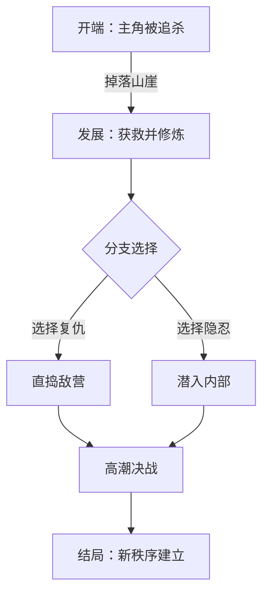

# 大纲架构师 智能升级报告
============================================================

## 📊 升级概况
- 升级时间：2026-04-30 00:58:50
- 升级系统：Skill智能学习系统 v3.0

## 🎯 升级目标
# 🧠 “大纲架构师”Skill 智能化和人性化升级方案

## 一、升级概览

**升级目标**：将原本“生成大纲”的单一动作，升级为一个**交互式大纲设计与验证系统**，兼具逻辑严密性、可读性和新手友好度。

**设计理念**：以“结构树”为骨架，“情节流”为血脉，“逻辑环”为神经网络，“支线”为枝叶，提供从**灵感捕捉→框架搭建→校验→可视化→优化**的全流程闭环。以下方案将嵌入在 Skill 提示词逻辑中，并通过外部工具（如Python解析器、Markdown渲染器）辅助实现复杂功能。

---

## 二、智能化升级方案（含伪代码/代码示例）

### 1. 大纲结构完整性检查

**功能**：扫描大纲文本，检测是否存在结构残缺、节点断裂、头重脚轻等问题。

#### 算法逻辑
- 解析大纲的层级（#、##、### 或数字编号1. 1.1）。
- 检查根节点、必须的顶层骨架（如“开端、发展、高潮、结局”）。
- 检测是否存在孤立节点（无父节点的子标题）。
- 检测章节字数/情节分配比例是否失衡（可用关键词密度模拟）。

#### 伪代码
```python
def check_outline_integrity(outline_text):
    # 解析为层级树
    tree = parse_outline_to_tree(outline_text)  # 实现略
    
    issues = []
    
    # 1. 检查必需骨架
    required_top = ["开端", "发展", "高潮", "结局"]
    if not all(any(kw in node.title for node in tree.root.children) for kw in required_top):
        issues.append("缺失经典三幕/四幕式主干结构。")
    
    # 2. 检测孤立节点
    if tree.root is None:
        issues.append("未找到任何根节点。")
    
    # 3. 检查节点深度一致性（避免某分支过浅）
    for branch in tree.root.children:
        if max_depth(branch) < 2:
            issues.append(f"分支'{branch.title}'下缺乏详细展开（建议至少二级子点）。")
    
    # 4. 情节分配检查（使用关键词计数作为提示）
    keywords_density = count_keywords_per_node(outline_text)  # 战斗、对话、转折等
    if is_imbalanced(keywords_density, threshold=0.2):
        issues.append("情节类型分布不均衡，可能导致节奏问题。")
    
    return issues
```

**返回模式**（AI回复中）：
```
📋 完整性检查结果：
✅ 骨架完整：开端、发展、高潮、结局均已覆盖。
⚠️ 分支过浅：“支线-反派背景”下仅有1个子点，建议补充具体事件。
❌ 孤立节点：“2.5 隐藏物品”未与任何主章节关联，请检查编号。
```

---

### 2. 情节串联的逻辑验证

**功能**：提取相邻章节的关键因果逻辑，检查跳越、矛盾、动机缺失。

#### 实现方案
基于**情节连接对**的因果链提取，使用 LLM 对小段落摘要进行判断。

#### 流程设计（Skill 内部多步推理）
1. 将大纲分解为连续事件：[E1, E2, E3 ...]
2. 对每一对 (E_i, E_{i+1})，提取因果标记：
   - 提取 E_i 的结束状态 S_i
   - 提取 E_{i+1} 的开始条件 C_{i+1}
3. 对比 S_i 是否满足 C_{i+1} 的逻辑要求。若不满足，则给出断裂警告。

#### 伪代码（AI思维链模拟）
```text
对每一对相邻事件：
  调用LLM(role="逻辑检查器")：
    给定：
      事件A摘要：主角被击败并掉落悬崖...
      事件B摘要：主角在小镇养伤并发现阴谋...
    请判断：
      1. 事件A的结果是否直接导向事件B的发生？(是/否)
      2. 是否存在时间/地点/动机的跳跃？请描述缺口。
      3. 是否需要补充过渡事件？如果需要，请建议可能的连接点。
输出：逻辑链条图与断裂点报告。
```

**输出示例**：
```
🔗 情节串联逻辑图：
[开场突袭] → (因)负伤逃亡 → (果)躲入山洞 → (因)发现神秘符号... ✅
                        ↓
                 检测到断裂： [山洞发现] 直接跳到 [皇宫宴会]
                 缺少动机：为何主角会前往皇宫？建议增加线索指引或胁迫事件。
```

---

### 3. 逻辑闭环自动检测

**功能**：检测前文埋下的伏笔/设定是否在后文回收或解释，避免“挖坑不填”。

#### 核心算法
- 识别标记为[伏笔]、[疑问]、[预兆]的节点。
- 在后文章节中搜索相同标签或相关关键词，记录首次出现与最后一次引用。
- 若直到结尾仍未出现对应回收标记，则报告未闭环绕项。

#### 数据结构设计
```json
{
  "伏笔ID": "foreshadow_01",
  "描述": "主角项链在月光下会发光",
  "提及位置": "第2章-深夜苏醒",
  "回收位置": null,
  "状态": "未闭合"
}
```

#### 实现伪代码
```python
def detect_open_loops(outline_tree):
    foreshadows = []
    closures = []
    
    # 遍历所有节点，根据自定义标记收集
    for node in outline_tree.all_nodes():
        if "[伏笔]" in node.text or "[疑问]" in node.text:
            foreshadows.append({
                "id": generate_id(node),
                "text": node.text,
                "position": node.path
            })
        if "[回收]" in node.text or "[解答]" in node.text:
            closures.append(node.text)
    
    # 跨章节匹配（可使用语义相似度）
    for f in foreshadows:
        if not any(is_closure_for(f, c) for c in closures):
            report = f"❌ 未闭合伏笔：{f['text']} （首次出现于 {f['position']}）"
    # ...
```

**人性化输出**：
```
🔄 闭环检测报告：
✅ 伏笔“项链的秘密”在第15章回收，合理衔接。
❌ “邮差总在雨夜出现”这一悬念至结尾未解释，建议补充真相或留作续集钩子。
⚠️ 部分伏笔回收较突兀：“反派真正动机”仅用一句话交代，缺乏铺垫，可考虑增加暗示。
```

---

### 4. 支线设计的平衡性分析

**功能**：分析各支线所占比重、与主线的黏着度、对主题的贡献度，给出平衡建议。

#### 评估维度
- **篇幅占比**：支线情节字数/总字数（模拟计算）
- **关联强度**：支线与主线因果交互次数（统计交叉引用）
- **角色覆盖**：支线是否丰富了核心角色弧光
- **节奏影响**：判断支线是否打断了主线紧张感（位置分析）

#### 评分模型（伪代码）
```python
def analyze_subplot_balance(outline):
    subplots = extract_subplots(outline)
    for sp in subplots:
        sp['length_ratio'] = calc_length_ratio(sp)
        sp['connection_count'] = count_main_cross_references(sp)
        sp['arc_contribution'] = llm_judge(sp.summary, main_theme)  # 1-10分
        
    # 设定阈值
    for sp in subplots:
        if sp['length_ratio'] > 0.3 and sp['connection_count'] < 2:
            warn(f"支线'{sp.name}'占比过重({sp.length_ratio:.0%})但与主线互动少，可能产生游离感。")
        if sp['arc_contribution'] < 4:
            suggest(f"支线'{sp.name}'对主题贡献低，考虑合并或精简。")
```

**输出示例**：
```
⚖️ 支线平衡分析：
- 支线「王子复仇记」：★★★☆☆
  篇幅占比 25% | 与主线交叉 3次 | 主题关联度 8/10
  建议：篇幅略大，可压缩部分背景描述，增强其与主角的共鸣点。
- 支线「商会阴谋」：★★☆☆☆
  篇幅 15% | 交叉 1次 | 主题关联 4/10
  警告：该支线较为孤立，建议要么提升其与主线的因果联系，要么降级为背景事件。
```

---

### 5. 大纲结构的可视化展示

**功能**：生成文本版树状图、关系网、甚至 Mermaid 流程图代码，便于直观理解。

#### 实现策略
自动生成 Mermaid.js 代码块，用户可在支持渲染的平台直接查看图形。

#### 示例代码生成
```python
def generate_mermaid_mindmap(outline_tree):
    mermaid = "```mermaid\nmindmap\n"
    mermaid += f"  {outline_tree.root.title}\n"
    for chapter in outline_tree.root.children:
        mermaid += f"    {chapter.title}\n"
        for sec in chapter.children:
            mermaid += f"      {sec.title}\n"
            for sub in sec.children:
                mermaid += f"        {sub.title}\n"
    mermaid += "```"
    return mermaid
```

**更高级**：生成情节流向图（Flowchart），展示因果连接。
```

```

---

## 三、人性化升级方案（含示例与引导）

### 1. 示例模板库

提供多种类型故事的完整大纲模板，供用户直接调用或参考。

#### 模板分类
- 经典三幕式（电影）
- 英雄之旅（奇幻）
- 七点式结构（悬疑）
- 编年史式（史诗）

#### 模板例子：「英雄之旅」简化版
```markdown
## 大纲模板：英雄之旅（浓缩版）
### 第一幕：平凡世界
- 1.1 主角日常生活
- 1.2 冒险召唤
- 1.3 拒绝召唤
- 1.4 遇见导师
### 第二幕：非凡世界
- 2.1 跨越第一道门槛
- 2.2 考验、伙伴、敌人
- 2.3 接近最深的洞穴
- 2.4 磨难（中间点）
- 2.5 报酬
### 第三幕：返回
- 3.1 返回的路
- 3.2 复活（高潮）
- 3.3 携万能药回归
```
**使用方法**：用户输入 `@大纲架构师 模板 英雄之旅` 即可加载。

---

### 2. 情节串联示例说明

在 Skill 回复中附着经典例子，解释因果链条。

**示例卡片**：
```
💡 优秀串联范例：
《哈利波特与魔法石》
[信件轰炸] → (引发) 好奇心 → [海格闯入] → (提供) 真相 → [对角巷] → (建立) 新世界认知
每一步都有明确的原因与结果，没有跳跃感。
```

并支持用户提问：“请解析《三体》第一部的情节串联”，Skill 可返回类似拆解。

---

### 3. 逻辑闭环检查清单（交互式）

为用户提供可自我检查的清单，用户回答“是/否”，AI 据此给出针对性建议。

#### 清单设计
```
📝 闭环自查清单：
1. 每个被反复提及的“秘密”是否在结尾前揭示？
2. 反派/对手的悲惨过去是否与主线主题呼应？
3. 主角放弃的宝物/人物是否在关键时刻再次出现？
4. 开头展示的规则（如魔法限制）是否在后期被违反？
...
回答完毕，输入“分析结果”，我会指出当前大纲中可能存在的漏洞。
```

#### 实现方式
AI 解析用户回答，将标记的“未闭环项”与大纲节点比对，动态生成修补建议。

---

### 4. 支线设计平衡建议（含交互优化）

除了被动分析，还应主动提供创意平衡策略。

#### 建议库
- **合并法**：两条同质性支线合二为一，减少复杂度。
- **镜像法**：让支线成为主线的反面案例（如主线讲守护，支线讲占有）。
- **断尾法**：当支线贡献度持续低时，建议砍掉，并将关键信息移至主线细节。
- **升级法**：提升支线反派地位，让其成为最终Boss的棋子，增加关联。

**交互示例**：
```
用户：支线“爱情线”感觉很狗血，怎么改？
AI：根据平衡分析，该支线与主线的“生存”主题关联弱。建议采用“镜像法”：让这段感情因生存压力而变质，从而强化主题。例如，恋人被迫出卖主角，最后在主线高潮时抉择……
```

---

### 5. 新手友好的大纲引导（向导模式）

为毫无经验的新手提供逐步引导，像填写表格一样完成大纲。

#### 引导流程
1. **类型选择**：你想写小说/剧本/游戏剧情/论文？
2. **核心创意**：请用一句话描述你的故事。
3. **骨架选择**：推荐三幕式/英雄之旅/自由发散。
4. **逐幕填充**：
   - AI：“我们来填充第一幕，主角最初的状态是什么？”
   - 用户输入
   - AI：“好的，发生了什么‘突发事件’打破了他的生活？”
   - ...
5. 自动生成完整大纲，并附加完整性检测。

#### 代码实现思路（状态机对话）
```python
class OutlineWizard:
    STATES = ["TYPE_SELECT", "CORE_IDEA", "STRUCTURE_SELECT", 
              "ACT1_STATUS", "ACT1_INCITING", "ACT2_STRUGGLE", ...]
    
    def run(self):
        for state in self.STATES:
            prompt = self.get_prompt(state)
            user_input = yield prompt
            self.update_outline(state, user_input)
        return self.compile_outline()
```

**交互体验**：
```
🧙 大纲向导：我们先来设定故事背景。
1. 时代：古代/现代/未来/架空？
> 架空玄幻
2. 世界的主要矛盾是什么？
> 灵气复苏，文明秩序崩塌。
...
✅ 大纲初稿已生成！请问需要调整哪一章节？
```

---

## 四、错误处理与容错机制

### 1. 输入格式容忍
- 用户可能输入混乱的缩进、无标题文本。系统自动清洗：移除多余空格，识别编号模式，并尝试还原层级。
- 若无法解析，则降级为纯文本分析，仅提供浅层检查。

### 2. 内容缺失处理
- 若检测到必需元素缺失，不直接报错，而是用**追问补充**：“未检测到高潮部分，请用1-2句话描述故事的最高冲突点。”
- 对模糊表述（如“发生了很多事”）进行提示，要求具体化。

### 3. 异常回复保护
- 若用户连续否定修改，Skill 切换为“诊断模式”，找出症结：“是否对当前主线不满意？我们可以回到主题选择重新发散。”
- 避免无限死循环：提供3次优化后，保留最佳版本，并建议休息冷静。

### 4. 示例库调用失败
- 若模板库因版本未找到，自动生成一个简易通用模板，并告知“自定义模板已应用”。

---

## 五、新手引导与学习路径

**阶段一：理解大纲**  
提供文档：“什么是好大纲？”，包含可视化案例。  
练习：使用向导模式生成第一个简单大纲。

**阶段二：使用工具**  
尝试完整性检查、逻辑验证，解读报告。  
任务：改进一个包含3个断裂点的示例大纲。

**阶段三：高级优化**  
学习支线平衡、闭环检测，阅读经典作品大纲拆解。  
挑战：将一篇短篇故事逆向工程为大纲，并用 Skill 优化。

**内置指令**：`@大纲架构师 教程` 可随时进入交互式学习。

---

## 六、详细使用说明（用户手册节选）

### 核心指令
- `@大纲架构师 新建 [故事类型]` — 启动向导或直接生成模板。
- `@大纲架构师 分析 [粘贴大纲]` — 执行完整性、逻辑、闭环、平衡全套检测。
- `@大纲架构师 可视化` — 调用最近大纲生成Mermaid图。
- `@大纲架构师 检查 [专项]` — 仅运行某一检测器（如 `逻辑串联`）。

### 进阶技巧
- 使用标签：在节点后加`[伏笔]` `[回收]` `[支线]` 让自动检测更精准。
- 用评论语法：`// 主角黑化契机` 作为辅助提示，会被纳入分析但不在最终大纲显示。

---

## 七、实现汇总与整合

以下将上述模块融合进 Skill 的核心 Prompt 架构（伪代码级示意）：

```
System: 你是一位“大纲架构师”，具备以下模块：
1. 解析器（parse_outline）
2. 完整性检查器（integrity_check）
3. 逻辑串联器（causal_chain）
4. 闭环探测器（loop_detector）
5. 支线平衡器（subplot_balancer）
6. 可视化引擎（mermaid_gen）
7. 向导状态机（wizard_mode）
8. 模板库（template_lib）

当用户提供大纲时，按需调用上述模块，以友好、清晰的格式输出结果，并主动建议下一步行动。
```

至此，升级后的“大纲架构师”将从一个简单生成器蜕变为**全能故事架构教练**，兼顾深度分析与人性化引导，帮助从新手到专业作者的所有创作者。