# 质量审计师 智能升级报告
============================================================

## 📊 升级概况
- 升级时间：2026-04-30 00:50:53
- 升级系统：Skill智能学习系统 v3.0

## 🎯 升级目标
# 《质量审计师》Skill 智能化和人性化升级方案

## 一、智能化升级方案

### 1. 多角度质量评估引擎

**设计思路**：将单一维度的“好/坏”评分扩展为六个评估维度，每个维度有独立权重和自动化检测规则，并通过加权算法生成综合质量报告。

**实现伪代码**：

```python
class MultiAngleEvaluator:
    def __init__(self):
        self.dimensions = {
            'literariness': {'weight': 0.25, 'name': '文学性'},   # 语言美感、修辞水平
            'consistency': {'weight': 0.20, 'name': '一致性'},   # 设定、时间线、人物特征
            'structure': {'weight': 0.20, 'name': '结构性'},     # 章节节奏、伏笔回收
            'logic': {'weight': 0.15, 'name': '逻辑性'},         # 情节因果、动机合理性
            'engagement': {'weight': 0.10, 'name': '吸引力'},    # 悬念设置、情绪曲线
            'originality': {'weight': 0.10, 'name': '独创性'}     # 设定新颖度、桥段重复度
        }
        self.thresholds = {
            'excellent': 85,
            'good': 70,
            'average': 50
        }

    def evaluate(self, novel_text, metadata=None):
        scores = {}
        evidence = {}
        for dim, config in self.dimensions.items():
            raw_score, dim_evidence = self._score_dimension(dim, novel_text)
            scores[dim] = raw_score
            evidence[dim] = dim_evidence

        weighted_total = sum(scores[d] * self.dimensions[d]['weight'] for d in scores)
        level = self._level_from_score(weighted_total)

        radar_chart_data = self._generate_radar_data(scores)

        return {
            'total_score': round(weighted_total, 1),
            'level': level,
            'dimension_scores': scores,
            'dimension_evidence': evidence,
            'visualization': radar_chart_data,
            'recommendation': self._improvement_plan(scores, level)
        }
```

**多角度检测规则示例（文学性）**：
- 被动句占比＞15% → 扣分
- 平均句长在15-25字之间 → 加分
- 连续相同开头句式重复≥3次 → 标记瑕疵
- 情感词汇密度与情节匹配度分析

---

### 2. 结构检查系统化审核

**设计思路**：将小说结构拆分为“三幕式-节拍”模型，自动识别关键节奏点，给出量化结构健康度。

**结构审核实现**：

```python
class StructureChecker:
    BEATS = ['setup', 'inciting_incident', 'turning_point1', 
             'midpoint', 'turning_point2', 'climax', 'resolution']
    
    def systematic_audit(self, chapters):
        beat_positions = self._detect_beats(chapters)
        timeline = self._build_timeline(chapters)
        empty_segments = self._find_empty_segments(timeline, beat_positions)
        
        feedback = {
            'beat_completeness': self._check_beat_presence(beat_positions),
            'pacing_issues': self._analyze_pacing(chapters, beat_positions),
            'subplot_map': self._extract_subplots(chapters),
            'foreshadowing_health': self._verify_foreshadowing(chapters),
            'visual_structure': self._draw_structure_diagram(chapters)
        }
        return feedback
    
    def _detect_beats(self, chapters):
        # 使用情节转折识别器（基于冲突强度变化、字数占比、情绪转折句）
        beats_found = {}
        for i, ch in enumerate(chapters):
            if self._is_inciting_incident(ch):
                beats_found['inciting_incident'] = i
            # ... 其他节拍检测
        return beats_found
```

**结构可视化模板**（自动生成Mermaid图）：

```mermaid
gantt
    title 小说结构图谱
    dateFormat  X
    axisFormat %s
    section 主线
    铺垫期       :0, 15
    激励事件     :15, 8
    第一转折     :23, 7
    中段发展     :30, 25
    第二转折     :55, 5
    高潮         :60, 10
    结局         :70, 10
```


---

### 3. 逻辑验证自动纠错

**设计思路**：建立知识图谱校验引擎，对人物关系、时间线、物品状态、地理信息进行一致性检查，并提供自动修正建议。

**逻辑验证与纠错流程**：

```python
class LogicValidator:
    def __init__(self):
        self.knowledge_graph = {}  # 运行时构建
        
    def validate_and_correct(self, novel_text):
        self._build_knowledge_graph(novel_text)
        errors = []
        corrections = []
        
        # 检查1：人物年龄流动
        age_errors = self._check_character_ages()
        for err in age_errors:
            fix = self._suggest_age_fix(err)
            corrections.append(fix)
            
        # 检查2：物品归属/状态
        item_errors = self._check_item_ownership()
        corrections.extend(self._suggest_item_fix(item_errors))
        
        # 检查3：时间线矛盾（如“三小时后，天黑了”但实际时间线不符）
        timeline_errors = self._check_timeline()
        corrections.extend(self._auto_correct_timeline(timeline_errors))
        
        # 检查4：权力/能力一致性（角色之前不能飞，突然能飞）
        ability_errors = self._check_ability_consistency()
        corrections.extend(self._suggest_ability_retcon(ability_errors))
        
        return {
            'errors_found': len(errors),
            'corrections': corrections,
            'confidence_map': self._confidence_for_each_correction()
        }
```

**自动纠错示例**（带置信度）：
- 检测：“第3章人物A左手受伤，第5章用左手握剑” → 建议修改为“右手挥剑”，置信度92%
- 检测：“设定魔法需要吟唱3秒，但第12章瞬发” → 建议补充说明“紧急爆发”或修改设定，置信度85%

---

### 4. 体验优化智能建议

**设计思路**：基于读者情绪模型和注意力曲线，提供章节级别的节奏调节、感官细节补充、对话密度优化等具体建议。

**建议生成引擎**：

```python
class ExperienceOptimizer:
    def smart_suggestions(self, chapter_analysis):
        suggestions = []
        
        # 规则1：情绪单调检测
        emotion_curve = chapter_analysis['emotion_curve']
        if self._monotone_emotion(emotion_curve):
            suggestions.append({
                'type': '节奏调节',
                'location': f"第{chapter_analysis['id']}章",
                'issue': '连续3页无情绪波动，易产生阅读疲劳',
                'solution': "在第2页插入一段角色内心冲突或外部干扰事件",
                'template_example': '他突然意识到，刚才那句话可能被误解了...'
            })
        
        # 规则2：感官描述稀疏
        senses = chapter_analysis['sensory_density']
        if senses['visual'] > 0.8 and senses['other'] < 0.2:
            suggestions.append({
                'type': '感官补充',
                'issue': '视觉描述占主导，缺乏听觉/嗅觉/触觉',
                'solution': "在环境描写中加入气味（如潮湿泥土味）或触感（如粗糙的树皮）",
                'location_range': "第3-5段"
            })
        
        # 规则3：对话/叙述比例失衡
        if chapter_analysis['dialogue_ratio'] < 0.15 and chapter_analysis['words'] > 3000:
            suggestions.append({
                'type': '交互增强',
                'issue': '长篇纯叙述，对话占比过低',
                'solution': "在段落间插入1-2句角色对话，打破叙事单调",
            })
        
        return suggestions
```

---

### 5. 质量评分可视化

**设计思路**：提供雷达图、柱状图、热力图和趋势线等多维度可视化，支持导出PNG/Lottie动画，并嵌入审计报告。

**代码实现（基于ECharts/前端）**：

```javascript
function renderQualityRadar(scores) {
    const option = {
        radar: {
            indicator: [
                { name: '文学性', max: 100 },
                { name: '一致性', max: 100 },
                { name: '结构性', max: 100 },
                { name: '逻辑性', max: 100 },
                { name: '吸引力', max: 100 },
                { name: '独创性', max: 100 }
            ],
            shape: 'polygon',
            center: ['50%', '50%'],
            radius: '70%'
        },
        series: [{
            type: 'radar',
            data: [{
                value: [
                    scores.literariness,
                    scores.consistency,
                    scores.structure,
                    scores.logic,
                    scores.engagement,
                    scores.originality
                ],
                name: '作品质量',
                areaStyle: { color: 'rgba(65, 158, 255, 0.3)' },
                itemStyle: { color: '#419EFF' }
            }],
            animation: true
        }],
        // 添加动态交互和工具提示
        tooltip: { 
            formatter: function(params) {
                let tips = '<div style="text-align:center;">';
                params.value.forEach((val, idx) => {
                    tips += `${params.name[idx]}: ${val}分<br>`;
                });
                return tips + '</div>';
            }
        }
    };
    chart.setOption(option);
}
```

同时生成章节点状质量热力图，显示每章不同维度表现。

---

## 二、人性化升级方案

### 1. 质量评估示例报告

**设计思路**：内置10份不同题材/水平的样例报告，用户可直接查看标准报告格式，理解审计结果的呈现方式。

**示例报告模板（片段）**：

```
━━━━━━━━━━━━━━━━━━━━━━━━━━
📊 《星海迷踪》质量审计报告
━━━━━━━━━━━━━━━━━━━━━━━━━━
综合评分：78.5 / 100 (良好)
评估日期：2025-03-21

▶ 维度得分雷达图 (附图)
  文学性 82  ████████░░
  一致性 65  ██████░░░░
  结构性 78  ████████░░
  逻辑性 72  ███████░░░
  吸引力 81  ████████░░
  独创性 74  ███████░░░

▶ 关键发现：
  ✅ 开篇悬念设置成功
  ⚠️ 第7章时间跳跃解释不足
  ❌ 人物A武器在第9章无说明消失

▶ 改进建议（按优先级）：
  1. [高] 修复时间线矛盾（详情见逻辑验证）
  2. [中] 优化中段叙事节奏
  3. [低] 增加环境感官描写

▶ 结构健康度：B级（缺少第二转折铺垫）
▶ 逻辑错误数：2（已自动修正1处）
━━━━━━━━━━━━━━━━━━━━━━━━━━
```

通过`show_example("fantasy")`可调用不同题材样例。

---

### 2. 结构检查清单模板

**设计思路**：生成可填写的自定义清单，支持章节、全文、人物线等不同粒度，用户可勾选并保存审计记录。

**交互式清单（Markdown可导出为PDF）**：

```markdown
## 📋 结构审计清单 - [书名] - 审核日期：____

### 一、整体结构
- [ ] 开篇在500字内建立主角日常
- [ ] 激励事件在总篇幅10%~15%位置
- [ ] 第一幕结束于重大抉择
- [ ] 中点逆转（假胜利/假失败）
- [ ] 第二幕铺垫——“黑暗时刻”
- [ ] 高潮解决主线矛盾
- [ ] 结局回扣主题，余韵

### 二、章级结构（逐章填写）
| 章 | 字数 | 情节推进 | 伏笔铺设 | 情绪峰值 | 问题标记 |
|----|------|----------|----------|----------|----------|
| 1  |      |          |          |          |          |
| 2  |      |          |          |          |          |

### 三、子线审计
- 感情线进展节点：□ 设置 □ 发展 □ 波折 □ 解决
- 悬疑线揭露节点：□ 第一次暗示 □ 误导 □ 真相浮现 □ 揭谜
```

用户可一键生成空白清单，Audit Skill将自动预填已分析内容。

---

### 3. 逻辑验证引导说明

**设计思路**：当发现逻辑问题时，不仅给出错误位置，更提供一步步引导，让新手作者理解“为什么是问题”和“常见解决方案”。

**引导流程示例**：

```python
def interactive_logic_guide(error):
    guidance_steps = [
        {
            "step": 1,
            "description": f"发现问题：{error['summary']}",
            "detail": f"在第{error['chapter']}章描述中，{error['context']}",
            "why_issue": "因为之前建立的设定是" + error['established_rule'] + "，而这里的行为违背了该规则。",
            "quiz": "你能指出哪一句与设定冲突吗？(点击高亮)",
            "solutions": [
                {
                    "name": "方案A：修改当前行为",
                    "example": "改为..." 
                },
                {
                    "name": "方案B：补充设定说明",
                    "example": "在此处插入一句'由于之前获得的新能力，他能够...'"
                }
            ],
            "learn_more": "参见《故事逻辑一致性指南》第3章"
        }
    ]
    return guidance_steps
```

在UI中实现为“下一步”→“了解更多”的分步弹窗，配以可点击示例。

---

### 4. 体验优化建议列表

**设计思路**：建议不再零散，而是整合为“行动建议卡”，每条卡片包含**问题、影响、方案、示例、难度、预计时间**，并支持按影响程度和难度排序。

**建议卡数据结构**：

```json
{
  "id": "sug-017",
  "category": "感官缺失",
  "title": "增加嗅觉和触觉细节",
  "severity": "中",
  "effort": "10分钟/千字",
  "problem_statement": "第3-7段缺乏非视觉感官描写，读者代入感下降",
  "solution": "在环境描写中融入1-2处听觉/嗅觉/触觉细节",
  "example_before": "他走进废弃工厂，四周都是生锈的机器。",
  "example_after": "他走进废弃工厂，铁锈的腥味扑面而来，脚下碎玻璃嘎吱作响，冷风顺着破窗灌进领口。",
  "learn_resource": "《描写感官的100个词汇表》",
  "one_click_apply": false  // 未来可开发自动增强工具
}
```

用户可批量勾选建议生成“修订任务清单”，导出至写作软件。

---

### 5. 新手友好审核引导

**设计思路**：首次使用触发“审核精灵”，通过对话式交互了解作者需求，自适应推荐检查深度和维度权重。

**引导流程（对话式）**：

```
精灵：Hi！我是审核向导小质。请告诉我你的小说处于哪个阶段呢？
选项： [灵感构思] [正在连载] [初稿完成] [修改阶段]

精灵：你更关注以下哪个方面？（可多选）
□ 情节紧凑度  □ 人物逻辑  □ 文笔提升  □ 出版标准

精灵：希望审计到什么程度？
○ 快速扫描（3分钟，大局观）
○ 标准审计（15分钟，主要问题+建议）
● 深度剖析（30分钟+，逐章分析）

精灵：是否使用专业术语？ [是] [否，我想看通俗解释]

精灵：好的，我将为你定制审计方案。现在请粘贴文本...
```

之后的所有输出都自动带上“查看通俗解释”链接，悬浮显示名词解释。

---

## 三、综合优化特性

### 1. 错误处理和容错机制

- **文本格式容错**：自动识别纯文本、Markdown、富文本、PDF（OCR），若识别失败引导手动标记章节。
- **超长文本处理**：对于＞50万字小说，启用分段分析，使用摘要模型提取关键节点再审计，避免Token溢出。
- **低质量内容提醒**：若检测到大量无意义重复内容或乱码，主动提示“文本质量低，结果可能不准确，建议清洗后再审计”。
- **置信度展示**：对每个自动分析结果标注置信度（高/中/低），低置信度建议人工确认。

### 2. 示例库和模板功能

构建内置数据库：
```python
example_library = {
    'templates': {
        'audit_report': ReportTemplate,  # 预制报告格式
        'structure_checklist': ChecklistTemplate,
        'suggestion_card': CardTemplate
    },
    'samples': {
        'xianxia_chapter1': '仙侠第1章示例.md',
        'scifi_plot_hole': '科幻逻辑错误案例.md',
        'romance_pacing': '言情节奏问题案例.md'
    },
    'reference': {
        'three_act_structure': '三幕式详解.pdf',
        'show_dont_tell': '描写技巧100例.docx'
    }
}
```

用户可以点击“加载案例”，Skill会用真实好/坏案例对比展示审计效果。

### 3. 学习路径设计

新手作者可进入“审计学院”：

- **初级课程**：先学习基础概念（三幕式、伏笔、对话比例），每课配示例和测试。
- **实战练习**：提供简短片段（比如500字），让用户手动寻找问题，再对比AI结果。
- **成就系统**：完成首次审计、首次自行修正逻辑错误等获得徽章，激励学习。

### 4. 完整使用说明（嵌入帮助）

可在任何时候发送`/help`获取上下文相关帮助：

```
/help structure  → 显示结构检查详细说明和示例
/help logic      → 解释逻辑验证的规则和置信度
/templates       → 查看所有可用模板
/examples        → 加载一个完整示例审计
/guided          → 启动新手引导流程
/setting         → 自定义权重、术语偏好等
```

---

## 四、结束语

通过以上智能化（多维评估、结构检测、逻辑纠错、体验建议、可视化）和人性化（示例报告、清单模板、分步引导、建议卡、新手对话）升级，**质量审计师** Skill 将从单纯“评分工具”转变为陪伴式写作教练，既满足专业作者深度分析需求，又降低新手上手门槛，真正实现“智能审计，温柔陪伴”。